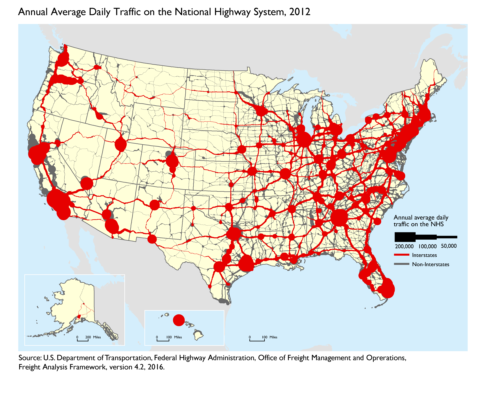
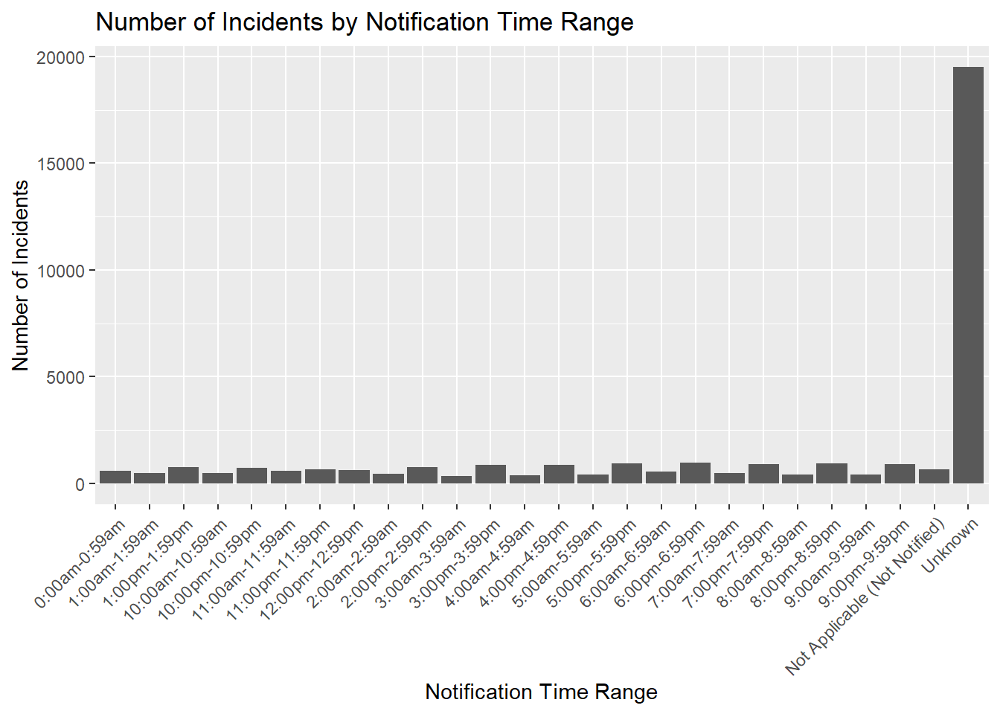
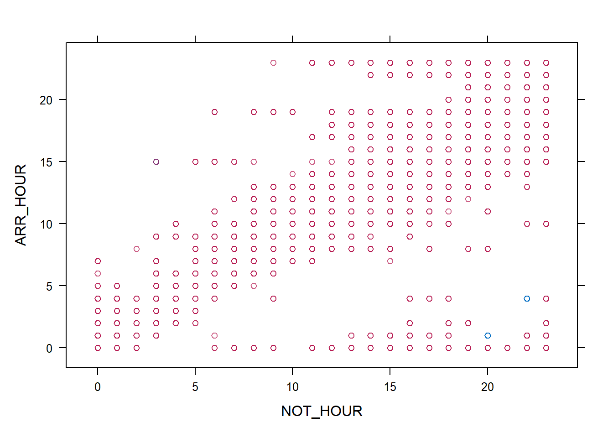
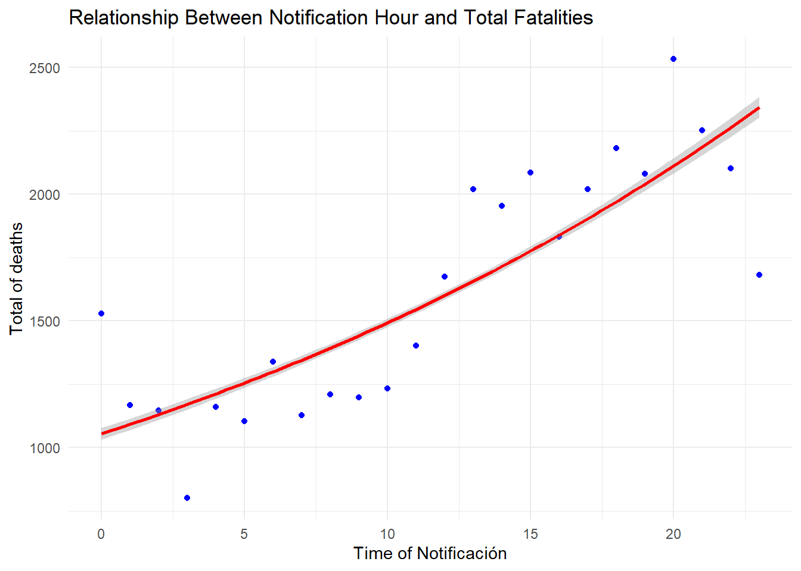

# 🚦 Traffic Accident Analysis: Exploring Key Factors and Risk Patterns



## 📌 Overview
This project analyzes **traffic accidents**, investigating the impact of **weather conditions, time factors, and emergency response efficiency** using R.

## 📑 Table of Contents
- [Dataset](#dataset)
- [Key Insights](#key-insights)
- [Data Analysis](#data-analysis)
- [Folder Structure](#folder-structure)
- [How to Use](#how-to-use)
- [Technologies Used](#technologies-used)
- [Contributing](#contributing)

## 📊 Dataset
The dataset includes:
- `accident.CSV`: Historical traffic accident data.
- `accident2022.CSV`: Traffic incidents from 2022.

## 🔬 Key Insights
✔️ **Weather conditions impact accident frequency.**  
✔️ **Emergency response time correlates with accident severity.**  
✔️ **Peak accident times identified for risk prevention.**  

## 📈 Data Analysis in R
### 1️⃣ **Exploratory Data Analysis**
- Analyzed accident severity and frequency using **ggplot2** and **dplyr**.
- **Example visualization:**
  
  
  
  **Example code:**
  ```r
  library(ggplot2)
  ggplot(accident_data, aes(x = severity, fill = weather_condition)) +
    geom_bar() + theme_minimal()
  ```

### 2️⃣ **Time-Series Analysis**
- Identified peak accident times using **lubridate**.
  
  
  
  ```r
  library(lubridate)
  accident_data$hour <- hour(accident_data$timestamp)
  ```

### 3️⃣ **Geospatial Analysis**
- Mapped accident hotspots using **leaflet**.
  
  
  
  ```r
  library(leaflet)
  leaflet(accident_data) %>% addTiles() %>%
    addCircleMarkers(~longitude, ~latitude, color = "red")
  ```

## 📂 Folder Structure
```
Traffic-Accident-Analysis/
│-- accident.CSV
│-- accident2022.CSV
│-- README.md
│-- Traffic.html
│-- Traffic.Rmd
│-- images/
│   ├── accident_distribution.png
│   ├── accident_trends.png
│   ├── accident_heatmap.png
```

## 🚀 How to Use
### 🛠 Installation
1️⃣ Clone the repository:
```sh
git clone git@github.com:ManuelRojasGarcia/Traffic-Accident-Analysis.git
cd Traffic-Accident-Analysis
```
2️⃣ Open `Traffic.Rmd` in **RStudio** and **run the analysis**.

## 📚 Technologies Used
- **R (ggplot2, dplyr, leaflet, lubridate)**
- **R Markdown** for report generation

## 🚀 Contributing
1️⃣ Fork the repo.  
2️⃣ Create a feature branch (`feature-analysis`).  
3️⃣ Submit a Pull Request.

📬 **Contact:** ManuelRojasGarcia@gmail.com


